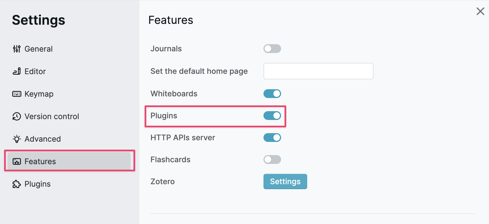

# logseq-plugin-react-boilerplate
> logseq-plugin-react-boilerplate with vite react typescript tailwindcss antd

## Demo

## Pre Requirements
1. [nodejs](https://nodejs.org/)
2. [pnpm](https://pnpm.io/)

## Usage
1. Use this template create your own plugin
2. change `package.json` name to your own plugin name
3. change LICENSE to your own license
4. change logo.png to your own logo
5. run `pnpm install` to install dependencies

### Browser mode with HMR

1. run `pnpm dev` to start vite server
2. Open HTTP APIs server Feature in logseq settings

3. add [Authorization tokens](https://haydenut.notion.site/English-fd47d1843e654f5485a07ef4935ed365?pvs=25#7a7a57de5a77480a84d30bc610d235c5) in logseq
   * API_SERVER=http://127.0.0.1:12315
   * API_TOKEN=123

4. open `localhost:5173` in browser

> [!TIP]
> Browser mode cannot access logseq plugin settings, you can add a file `mocks/settings.local.json` to mock.

### Plugin mode
This mode doesn't support HMR, you need to run `pnpm build` and reload plugin in logseq to see the changes
1. run `pnpm build:plugin` to build plugin
2. Open Plugins feature in logseq settings

3. Click `Load unpacked plugin` and select this project folder

## Release new version
1. push to `main` branch
2. github ci will auto create a new release

## Publish to [logseq marketplace](https://github.com/logseq/marketplace)

Create PR to add your plugin message to [logseq/marketplace](https://github.com/logseq/marketplace)